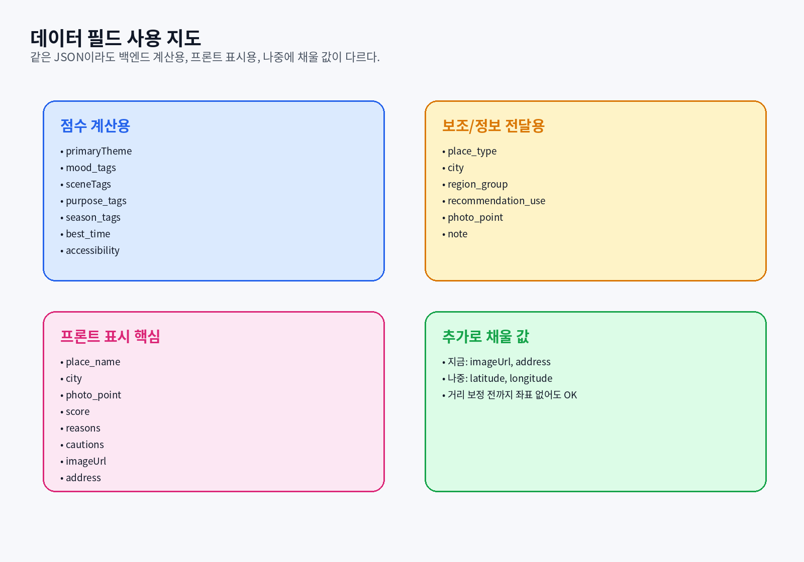

# 공통 데이터 사전 — GOAT 태그와 필드 의미

> 백엔드와 프론트가 같은 단어를 다르게 이해하지 않도록 만든 공통 사전입니다.



---

## 1. 장소 데이터 큰 구조

`goat_simplified_scoring_tags_v10_accessibility_merged.json`은 크게 두 부분입니다.

| 상위 필드 | 의미 |
|---|---|
| `tag_sets` | 서비스에서 허용하는 태그 목록. 잘못된 태그가 들어오는 것을 막는 기준표 |
| `places` | 실제 추천 후보 58개 장소 데이터 |

---

## 2. 점수 계산용 필드

| 필드 | 쉬운 의미 | 백엔드 사용법 | 프론트 사용법 |
|---|---|---|---|
| `primaryTheme` | 장소의 대표 무드 그룹 | 사용자 선택 테마와 같으면 큰 점수 | 카드 배지로 표시 가능 |
| `mood_tags` | 장소의 감성 키워드 | 사용자/AI 감성 태그와 일치 개수 계산 | 보통 숨김 |
| `sceneTags` | 사진에 보이는 장면 요소 | 사용자/AI 장면 태그와 일치 개수 계산 | 보통 숨김 |
| `purpose_tags` | 이 장소가 어울리는 여행 목적 | 사용자의 여행 목적과 맞으면 점수 | 상세에 표시 가능 |
| `season_tags` | 어울리는 계절 | 현재 계절과 비교 | 상세에 표시 가능 |
| `best_time` | 추천 방문 시간대 | 점수 계산 제외 | 카드/상세에 표시 |
| `accessibility` | 이동수단별 접근성 | 자차/대중교통/도보중심 점수 | 접근성 칩으로 표시 |

---

## 3. 보조/정보 전달용 필드

| 필드 | 쉬운 의미 | 사용 방식 |
|---|---|---|
| `place_id` | 장소 고유 ID | DB 저장, 추천 이력, 노출 통계 키 |
| `place_name` | 장소명 | 프론트 카드 제목 |
| `city` | 시/군 | 프론트 지역 표시, 지도 검색 보조 |
| `region_group` | 권역 | 지역 분산/상세 표시 참고 |
| `place_type` | 장소 유형 | 직접 점수는 아니고 동률/중복 비교 보조 |
| `photo_point` | 여기서 어떤 사진을 찍을 수 있는지 | 프론트 추천 카드 핵심 설명 |
| `recommendation_use` | 어떤 코스로 추천하면 좋은지 | 카드 설명 문구 |
| `note` | 운영/안전/주의 메모 | `cautions` 생성 참고 |

---

## 4. 추가로 채울 값

| 필드 | 지금 상태 | 필요 시점 | 의미 |
|---|---|---|---|
| `imageUrl` | 아직 없음 | 지금 당장 | 추천 카드 대표 이미지 |
| `address` | 아직 없음 | 지금 당장 | 상세 주소, 지도앱 연결 |
| `latitude` | 아직 없음 | 거리 보정할 때 | 위도 |
| `longitude` | 아직 없음 | 거리 보정할 때 | 경도 |

---

## 5. primaryTheme 7가지

| 값 | 의미 |
|---|---|
| `바다·해안 무드` | 바다, 해변, 해안도로, 해안산책로 중심 |
| `일본 소도시·골목 무드` | 일본풍 정원, 료칸, 골목, 철길, 서점 중심 |
| `알프스·고원·목장 무드` | 목장, 초원, 고원, 설경, 별 중심 |
| `숲·정원·자연휴식 무드` | 숲길, 정원, 호수, 힐링 중심 |
| `레트로·시장·항구 무드` | 시장, 항구, 야간거리, 빈티지 중심 |
| `건축·전시·랜드마크 무드` | 미술관, 건축, 전망대, 협곡, 랜드마크 중심 |
| `휴양·카페·이국공간 무드` | 카페, 리조트, 풀빌라, 산토리니/발리 감성 중심 |

---

## 6. purpose_tags 7가지

| 값 | 의미 |
|---|---|
| `사진·포토스팟` | 사진 찍기 좋은 장소 |
| `산책·힐링` | 걷기, 자연휴식, 조용한 장소 |
| `카페·실내휴식` | 카페나 실내 공간 중심 |
| `전시·건축관람` | 미술관, 건축물, 전시 공간 |
| `체험·액티비티` | 서핑, 테마파크, 출렁다리, 목장 체험 등 |
| `먹거리·야간탐방` | 시장, 항구, 야간거리, 먹거리 동선 |
| `숙소·리조트` | 숙박, 리조트, 풀빌라 중심 |

---

## 7. best_time 6가지

| 값 | 의미 |
|---|---|
| `새벽` | 일출, 이른 아침, 별 촬영 후 이동 포함 |
| `오전` | 오전 방문이 좋은 장소 |
| `한낮` | 밝은 바다색, 액티비티, 꽃밭처럼 낮 빛이 중요한 장소 |
| `오후` | 카페, 전시, 산책, 실내외 모두 무난한 시간 |
| `저녁` | 노을, 야경 시작, 항구/시장 분위기 |
| `야간` | 별, 은하수, 밤거리 중심 |

---

## 8. accessibility 구조

```json
"accessibility": {
  "public_transport": "중",
  "car": "상"
}
```

| 값 | 점수 | 의미 |
|---|---:|---|
| `상` | 12점 | 해당 이동수단으로 접근 좋음 |
| `중` | 7점 | 접근 가능하지만 조금 불편할 수 있음 |
| `하` | 1점 | 해당 이동수단으로 접근 불리함 |

현재 원본 데이터에는 `walk`가 없습니다. 그래서 `도보중심`은 엔진이 `sceneTags`, `place_type`, `photo_point`를 보고 추정합니다.
