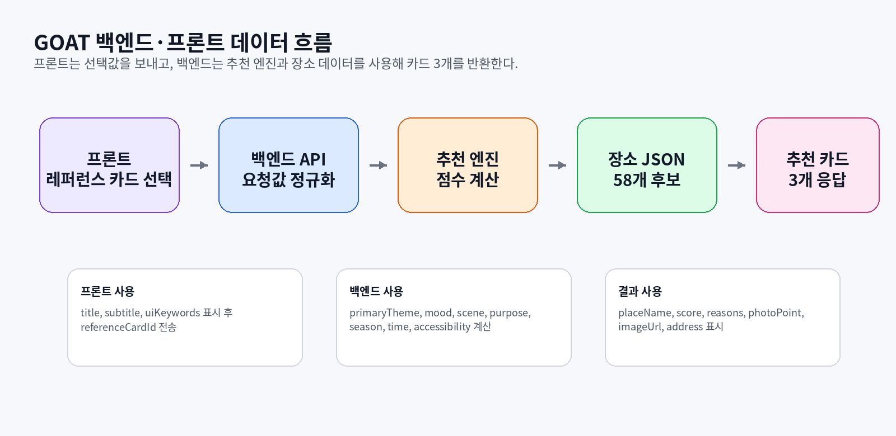

# 백엔드 전달 README — GOAT 추천 엔진 사용법

> 이 폴더는 백엔드가 추천 로직을 실제 API에 붙일 때 사용하는 파일입니다.



---

## 1. 백엔드가 받아야 하는 파일

| 파일/폴더 | 백엔드 사용 여부 | 설명 |
|---|---:|---|
| `src/goatRecommendationEngine.ts` | 필수 | 추천 점수 계산과 카드 3개 선별 로직 |
| `src/goatRecommendationTypes.ts` | 필수 | 요청/응답/장소/카드 타입 정의 |
| `src/index.ts` | 필수 | 외부에서 import할 진입점 |
| `data/goat_simplified_scoring_tags_v10_accessibility_merged.json` | 필수 | 58개 장소 데이터 + 태그 기준 |
| `data/goat_reference_cards_v2_balanced.json` | 필수 | 사용자가 고르는 21개 레퍼런스 카드와 후보 장소 연결 |
| `examples/sampleRequests.json` | 참고 | 요청 예시 |
| `tests/recommendationEngine.spec.ts` | 참고/권장 | 추천 로직이 깨지지 않았는지 확인하는 테스트 |
| `package.json`, `tsconfig.json` | 권장 | 단독 실행/테스트할 때 사용 |

---

## 2. 백엔드 사용 흐름

```txt
프론트 요청 수신
→ referenceCardId, travelPurpose, transportType 받기
→ currentMonth 계산
→ recommendGoatPlaces(request, placesDataset, referenceDataset) 실행
→ 결과 JSON 저장 또는 바로 응답
→ 프론트에 추천 카드 3개 전달
```

---

## 3. 백엔드 코드 예시

```ts
import { recommendGoatPlaces } from "./src";
import placesDataset from "./data/goat_simplified_scoring_tags_v10_accessibility_merged.json";
import referenceDataset from "./data/goat_reference_cards_v2_balanced.json";

const result = recommendGoatPlaces(
  {
    referenceCardId: body.referenceCardId,
    travelPurpose: body.travelPurpose,
    transportType: body.transportType,
      currentMonth: new Date().getMonth() + 1,

    // 선택 사항: 나중에 추천 노출 보정용
    totalExposureByPlaceId: exposureStats?.total,
    recentExposureByPlaceId: exposureStats?.recent,

    // 선택 사항: 나중에 거리 보정용
    routeDistanceKmByPlaceId: routeDistances,
  },
  placesDataset,
  referenceDataset
);

return result;
```

---

## 4. 백엔드가 프론트에서 받아야 하는 값

| 요청값 | 필수 여부 | 예시 | 의미 |
|---|---:|---|---|
| `referenceCardId` | 필수 | `REF_SEA_02` | 사용자가 선택한 레퍼런스 카드 ID |
| `travelPurpose` | 권장 | `사진·포토스팟` | 여행 목적 7가지 중 1개 |
| `transportType` | 권장 | `자차` | 이동수단: 자차/대중교통/도보중심 |
| `visitTime` | 제외 | - | 점수 계산에서 사용하지 않음. 보내도 엔진에서 무시 |
| `currentMonth` | 백엔드 계산 | `7` | 현재 계절 계산용. 프론트가 안 보내도 됨 |

---

## 5. 추천 점수 계산에 쓰는 데이터

| 데이터 | 위치 | 백엔드 사용 방식 |
|---|---|---|
| `primaryTheme` | place + reference card | 사용자가 고른 테마와 장소 테마가 같으면 18점 |
| `mood_tags` | place + reference card | 감성 태그가 몇 개 맞는지 계산 |
| `sceneTags` | place + reference card | 장면 태그가 몇 개 맞는지 계산 |
| `purpose_tags` | place | 사용자의 여행 목적과 맞으면 16점 |
| `season_tags` | place | 현재 계절 또는 사계절 여부 계산 |
| `best_time` | place | 점수 계산 제외. 카드/상세 화면의 추천 방문 시간 표시용 |
| `accessibility` | place | 자차/대중교통/도보중심 접근성 점수 계산 |
| `place_type` | place | 직접 점수 X, 동률/보조 비교용 |

---

## 6. 점수 구조

```txt
baseScore = 방문 무드 매칭 45점 + 방문 조건 적합도 45점
final/displayScore = baseScore + routeDistanceBonus - duplicatePenalty
```

| 점수 묶음 | 최대 점수 | 구성 |
|---|---:|---|
| 방문 무드 매칭 | 45점 | primaryTheme 18 + mood_tags 최대 17 + sceneTags 최대 10 |
| 방문 조건 적합도 | 45점 | 목적 16 + 접근성 12 + 시간 8 + 계절 9 |
| 거리 조정 | 10점 | 2번/3번 카드에만 적용. 현재 좌표 없으면 0점 |

---

## 7. 카드 3개 선별 방식


| 카드 | 백엔드 선별 기준 |
|---|---|
| 1번 카드 | `primaryTheme` 일치 후보 중 `baseScore` 1위. 거리/노출 보정 적용하지 않음 |
| 2번 카드 | 1번과 같은 `primaryTheme` 후보 우선. 같은 장소 제외. 중복 페널티, 거리 보너스, 노출 보정 적용 |
| 3번 카드 | 조건 점수 높은 후보 우선. `primaryTheme` 달라도 가능. 단, 목적이 있으면 `purpose_tags` 미일치 후보 제외 |

---

## 8. 백엔드 응답 형태

```ts
{
  status: "DONE",
  resultType: "RECOMMEND",
  score: 83,
  message: "추천 카드 3개 생성 완료",
  resultData: {
    cards: [/* 3개 카드 */],
    alternatives: [/* 대안 후보 */],
    warnings: []
  },
  failReason: null
}
```


`warnings`는 개발/운영 로그용입니다. 특히 `CARD3_PURPOSE_FALLBACK`은 카드3 조건맞춤 후보에서 여행 목적 태그가 맞는 장소가 0개라 전체 후보로 fallback했다는 뜻입니다. 현재 엔진은 warning이 1개 이상 있으면 기본적으로 `[GOAT_RECOMMENDATION_WARNING]` 서버 로그를 자동 출력합니다. JSONL 로그 파일은 기본 `logs/goat-recommendation-warnings.jsonl`에 자동 저장됩니다. `warningLogFilePath`를 요청에 넣거나 서버 환경변수 `GOAT_RECOMMENDATION_LOG_FILE`을 설정하면 저장 경로를 바꿀 수 있습니다.

프론트에는 `resultData.cards`만 먼저 보여주면 됩니다.  
`alternatives`는 “다른 후보 더보기”가 필요할 때 사용하면 됩니다.

---

## 9. 현재 비어 있어도 괜찮은 값

현재 장소 JSON에는 `imageUrl`, `address`, `latitude`, `longitude`가 없습니다.

| 값 | 현재 영향 | 백엔드 처리 |
|---|---|---|
| `imageUrl` | 프론트 카드 이미지 표시 불가 | 없으면 `null`로 내려감 |
| `address` | 지도앱 정확 연결 약함 | 없으면 `null`로 내려감 |
| `latitude`, `longitude` | 거리 보정 불가 | 없으면 `routeDistanceBonus = 0` |

지금 당장 추천 로직은 정상 작동합니다.  
데이터 보강은 `imageUrl`, `address`부터 하면 됩니다.

---

## 10. 테스트 방법

```bash
cd SEND_TO_BACKEND
npm run build
npm run test
npm run demo
```

테스트가 통과하면 추천 엔진은 정상입니다.

## 2026-07-02 추가 수정: warning 로그 상세 추적

`CARD3_PURPOSE_FALLBACK` 발생 시 로그에는 이제 단순 warning 코드만 남기지 않고, 아래 정보를 함께 기록한다.

- `warnings[].details.reason`: fallback이 발생한 직접 이유
- `warnings[].details.strictPurposePoolSize`: 카드3에서 여행 목적과 일치한 후보 수
- `warnings[].details.fallbackPoolSize`: fallback 후 사용한 후보 수
- `decisionAudit.fallback`: fallback 사용 여부, 이유, 목적값, 후보 수
- `decisionAudit.cardSelections[]`: 1번/2번/3번 카드 각각의 선택 이유
- `decisionAudit.cardSelections[].scoreSummary`: moodScore, conditionScore, baseScore, routeDistanceBonus, duplicatePenalty, exposurePenalty, coverageBoost, lowExposureBoost, selectionScore, displayScore
- `decisionAudit.cardSelections[].scoreDetails`: 테마, mood_tags, sceneTags, purpose_tags, accessibility, season_tags 세부 매칭 결과와 점수
- `decisionAudit.cardSelections[].reasons`: 프론트 카드에 표시 가능한 추천 이유 문장

따라서 서버 로그 또는 `logs/goat-recommendation-warnings.jsonl`만 확인해도 “왜 fallback이 발생했는지”와 “각 카드가 왜 뽑혔는지”를 추적할 수 있다.


## 2026-07-02 추가 수정: 다시 추천/재노출 방지 실제 연결

기존에는 엔진에 `recentExposureByPlaceId`, `totalExposureByPlaceId`, `themeAverageExposure` 보정 로직은 있었지만, 서비스 레이어에서 해당 값을 넘기지 않으면 항상 0점처럼 동작했다. 이번 수정에서 백엔드가 바로 붙일 수 있도록 아래 파일을 추가했다.

| 파일 | 역할 |
|---|---|
| `src/recommendationService.ts` | 실제 API 서비스 레이어 예시. 추천 전 노출 통계 조회 → 엔진에 전달 → 추천 결과 노출 저장까지 처리 |
| `src/recommendationExposureRepository.ts` | 노출 로그 저장소 인터페이스와 테스트용 InMemory 구현 |

권장 호출 흐름:

```ts
import {
  createGoatRecommendation,
  InMemoryRecommendationExposureRepository,
} from "./src";
import placesDataset from "./data/goat_simplified_scoring_tags_v10_accessibility_merged.json";
import referenceDataset from "./data/goat_reference_cards_v2_balanced.json";

const exposureRepository = new InMemoryRecommendationExposureRepository();

const result = await createGoatRecommendation({
  body: {
    referenceCardId: body.referenceCardId,
    travelPurpose: body.travelPurpose,
    transportType: body.transportType,
      rerollOfRequestId: body.rerollOfRequestId, // 다시 추천이면 직전 requestId
  },
  context: {
    requestId,
    userId,
    sessionId,
    recentLimit: 20,
  },
  placesDataset,
  referenceDataset,
  exposureRepository,
});
```

`createGoatRecommendation()`이 하는 일:

```txt
1. rerollOfRequestId가 있으면 직전 카드 3개의 placeId 조회
2. 그 placeId들을 excludePlaceIds에 넣어 방금 본 카드 재등장 강제 차단
3. recentExposureByPlaceId / totalExposureByPlaceId / themeAverageExposure 조회
4. 조회한 노출 통계를 recommendGoatPlaces()에 전달
5. 추천 결과 카드 3개를 exposureRepository.saveExposures()로 저장
```

실제 DB 테이블 예시:

```sql
CREATE TABLE recommendation_exposures (
  id BIGINT AUTO_INCREMENT PRIMARY KEY,
  request_id VARCHAR(64) NOT NULL,
  user_id VARCHAR(64),
  session_id VARCHAR(64),
  place_id VARCHAR(32) NOT NULL,
  rank_no INT NOT NULL,
  card_role VARCHAR(50),
  reference_card_id VARCHAR(64),
  primary_theme VARCHAR(100),
  travel_purpose VARCHAR(100),
  created_at TIMESTAMP DEFAULT CURRENT_TIMESTAMP
);
```

중요 기준:

```txt
- rerollOfRequestId / excludePlaceIds = 방금 본 카드 재등장 강제 방지
- recentExposureByPlaceId = 최근 자주 나온 장소 감점
- totalExposureByPlaceId + themeAverageExposure = 전체적으로 덜 나온 장소 보정
```

이번 테스트에는 아래 항목을 추가했다.

```txt
- 첫 추천 결과 카드 3개가 exposureRepository에 저장되는지
- 다시 추천 시 직전 requestId의 카드 3개가 excludePlaceIds로 제외되는지
- service가 recentExposureByPlaceId를 엔진에 넘겨 card2/card3 exposurePenalty가 실제 반영되는지
```

서비스 레이어를 쓰면 응답의 `resultData.requestId`가 자동으로 들어간다. 프론트는 다시 추천 시 이 값을 `rerollOfRequestId`로 보내면 된다.
