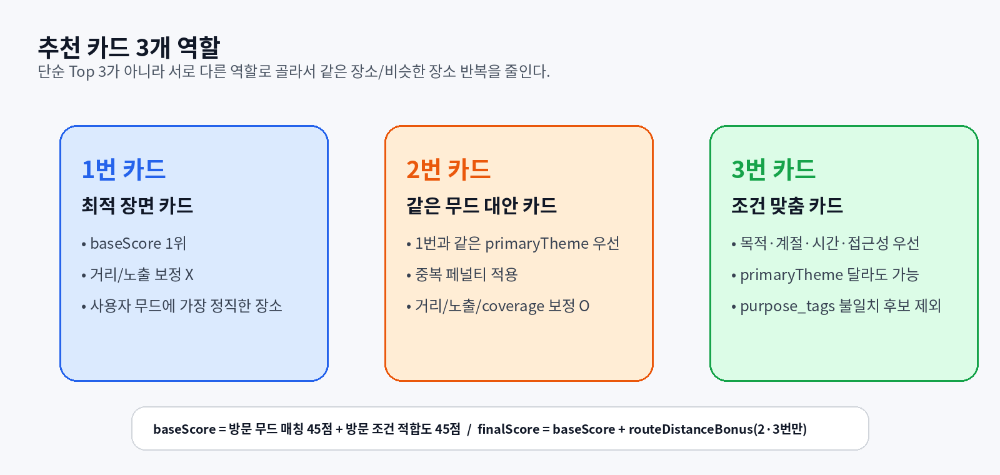

# GOAT 백엔드·프론트엔드 전달 패키지 v1

> 목적: 지금까지 만든 GOAT 추천 엔진과 JSON 데이터를 **백엔드/프론트엔드가 바로 이해하고 사용할 수 있게** 폴더별로 정리한 핸드오프 문서입니다.


---

## 0. 이 패키지에서 바로 보내면 되는 폴더

| 보낼 대상 | 폴더 | 보내는 이유 |
|---|---|---|
| 백엔드 | `SEND_TO_BACKEND/` | 추천 점수 계산 엔진, 장소 데이터, 레퍼런스 카드 데이터, 테스트 코드 포함 |
| 프론트엔드 | `SEND_TO_FRONTEND/` | 레퍼런스 카드 UI 데이터, 추천 결과 타입, 샘플 응답 포함 |
| 공통 참고 | `COMMON_REFERENCE/` | 태그/필드 뜻, 점수 기준, API 계약, 원본 기준 파일 정리 |

---

## 1. 최종 파일 구조

```txt
GOAT_backend_frontend_handoff_v1/
├─ README.md
├─ assets/
│  ├─ 01_backend_frontend_flow.png
│  ├─ 02_card_role_logic.png
│  └─ 03_data_field_map.png
├─ SEND_TO_BACKEND/
│  ├─ README_BACKEND_HANDOFF.md
│  ├─ package.json
│  ├─ tsconfig.json
│  ├─ src/
│  │  ├─ goatRecommendationEngine.ts
│  │  ├─ goatRecommendationTypes.ts
│  │  └─ index.ts
│  ├─ data/
│  │  ├─ goat_simplified_scoring_tags_v10_accessibility_merged.json
│  │  └─ goat_reference_cards_v2_balanced.json
│  ├─ examples/
│  │  ├─ demo.ts
│  │  └─ sampleRequests.json
│  └─ tests/
│     └─ recommendationEngine.spec.ts
├─ SEND_TO_FRONTEND/
│  ├─ README_FRONTEND_HANDOFF.md
│  ├─ data/
│  │  └─ goat_reference_cards_v2_balanced.json
│  ├─ types/
│  │  └─ goatFrontendRecommendationTypes.ts
│  └─ examples/
│     ├─ recommendation_result_sample.json
│     └─ reference_card_ui_sample.json
└─ COMMON_REFERENCE/
   ├─ README_DATA_DICTIONARY.md
   ├─ README_SCORE_AND_CARD_POLICY.md
   ├─ README_API_CONTRACT.md
   └─ source_files/
      └─ 원본 기준 파일들
```

---

## 2. 핵심 요약

GOAT 추천은 사용자가 고른 **레퍼런스 카드** 또는 AI가 뽑은 **무드/장면 태그**를 기준으로 강원 장소 61개 중 추천 카드 3개를 뽑습니다.



| 카드 | 역할 | 핵심 기준 |
|---|---|---|
| 1번 카드 | 최적 장면 카드 | 사용자가 고른 무드/장면에 가장 정직하게 맞는 장소 |
| 2번 카드 | 같은 무드 대안 카드 | 1번과 같은 무드 안에서 다른 대안 |
| 3번 카드 | 조건 맞춤 카드 | 목적, 계절, 시간, 접근성이 좋은 장소 |

---

## 3. 현재 진짜 필요한 추가 데이터

현재 추천 점수 계산 자체는 이미 가능합니다. 다만 실제 화면과 거리 보정을 위해 아래 4개만 추가하면 됩니다.

| 우선순위 | 필드 | 지금 필요한 이유 |
|---:|---|---|
| 1 | `imageUrl` | 추천 카드 대표 이미지 표시 |
| 2 | `address` | 상세 카드 주소 표시, 지도앱 검색 연결 |
| 3 | `latitude` | 나중에 2번/3번 카드 거리 보정 |
| 4 | `longitude` | 나중에 2번/3번 카드 거리 보정 |

> 지금 당장 채울 값은 `imageUrl`, `address`입니다.  
> 거리 보정까지 할 때 `latitude`, `longitude`를 나중에 채우면 됩니다.

---

## 4. 백엔드가 봐야 할 문서

백엔드는 아래 순서대로 보면 됩니다.

1. `SEND_TO_BACKEND/README_BACKEND_HANDOFF.md`
2. `COMMON_REFERENCE/README_API_CONTRACT.md`
3. `COMMON_REFERENCE/README_SCORE_AND_CARD_POLICY.md`
4. `COMMON_REFERENCE/README_DATA_DICTIONARY.md`

백엔드 핵심 작업은 **프론트 요청값을 받아 `recommendGoatPlaces()`를 실행하고 결과를 그대로 API 응답으로 내려주는 것**입니다.

---

## 5. 프론트엔드가 봐야 할 문서

프론트엔드는 아래 순서대로 보면 됩니다.

1. `SEND_TO_FRONTEND/README_FRONTEND_HANDOFF.md`
2. `SEND_TO_FRONTEND/examples/reference_card_ui_sample.json`
3. `SEND_TO_FRONTEND/examples/recommendation_result_sample.json`
4. `COMMON_REFERENCE/README_DATA_DICTIONARY.md`

프론트 핵심 작업은 **레퍼런스 카드 21개를 화면에 보여주고, 사용자가 고른 `referenceCardId`와 조건값을 백엔드로 보내는 것**입니다.

---

## 6. 근거 파일

이 패키지는 아래 파일 기준으로 정리했습니다.

| 기준 파일 | 사용 목적 |
|---|---|
| `goat_simplified_scoring_tags_v10_accessibility_merged.json` | 61개 장소와 점수 계산용 태그 기준 |
| `goat_reference_cards_v2_balanced.json` | 프론트 레퍼런스 카드 21개와 후보 연결 기준 |
| `점수 산정 방식(기준).txt` | 90점 baseScore + 10점 거리 보정 기준 |
| `goatRecommendationEngine.ts` | 실제 추천 엔진 구현 코드 |
| `README_GOAT_RECOMMENDATION_ENGINE.md` | 기존 추천 엔진 설명서 |
