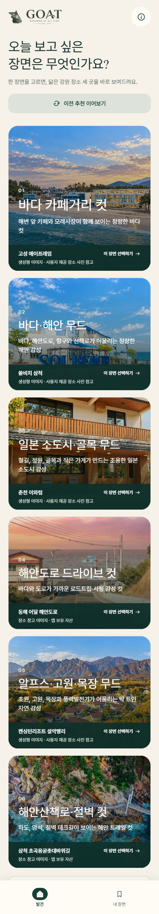
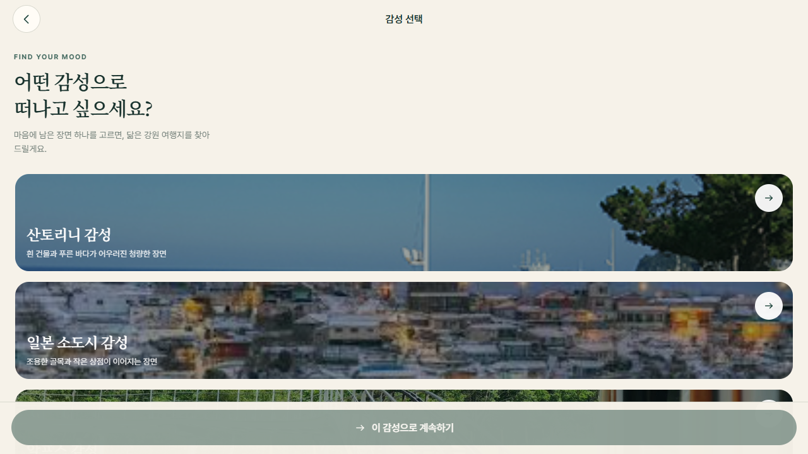
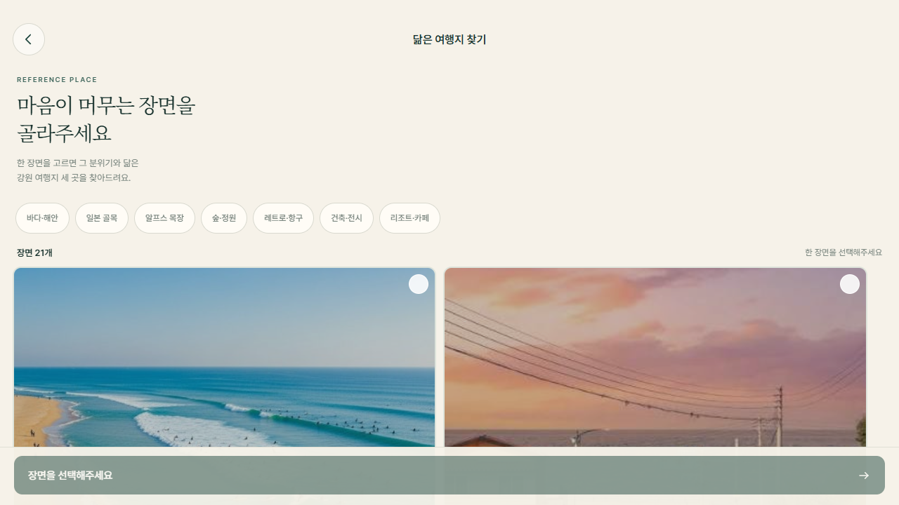

# GOAT — Gangwon Of All Time

> 오늘 기분과 여행 조건에 맞는 강원도 여행지 3곳을 추천하는 감성 기반 모바일 앱

[소스 저장소](https://github.com/da960822-ux/GOAT) · 배포 링크: 공개 URL 미제공 · 데모 영상: 미제공

현재 README에서 확인 가능한 증거는 커밋된 화면 캡처와 로컬 실행·계약 검증 코드입니다. 운영 배포 주소, 데모 영상, 운영 환경 로그는 저장소에서 확인되지 않습니다.

## 핵심 화면

<p align="center">
  
  
  
</p>
<p align="center">
  홈 · 감성으로 찾기 · 닮은 여행지로 찾기
</p>

전체 라우트와 캡처 기준은 [화면 캡처 매니페스트](artifacts/goat-mobile/SCREENSHOT_MANIFEST.md)에서 확인할 수 있습니다.

## 내가 만든 것

담당: Jung — 모바일 경험, 추천 플로우 통합, API 연동, 검증 자동화

- Expo Router 기반 모바일 화면과 사용자 플로우 구현: 홈, 감성 선택, 레퍼런스 선택, 여행 조건, 분석, 추천 결과, 상세, 지도, 저장 목록, 로그인·오류 상태
- 감성 선택과 레퍼런스 선택을 하나의 추천 요청 모델로 통합하고, 추천 재시도·재추천에도 최초 선택을 유지
- Express 추천 API와 모바일 클라이언트 연결: 요청 검증, `Idempotency-Key`, 인증·오류 라우팅, 추천 결과 저장
- Kakao 길찾기·한국관광공사 데이터 연동과 외부 API 장애 시 대체 경로 처리
- 화면 캡처와 계약 검증 스크립트 작성: [v2 UI 검증](artifacts/goat-mobile/scripts/verify-v2-ui.mjs), [추천 플로우 검증](artifacts/goat-mobile/scripts/verify-recommendation-flow.mjs)

주요 구현 근거: [모바일 라우트](artifacts/goat-mobile/app), [추천 클라이언트](artifacts/goat-mobile/src/services/recommendationApi.ts), [추천 API](artifacts/api-server/src/routes/recommendations.ts), [추천 오케스트레이터](artifacts/api-server/src/services/recommendation-orchestrator.ts)

## 어려웠던 문제 3개와 해결 방식

### 1. 서로 다른 진입점을 하나의 추천 계약으로 통합

감성 선택과 레퍼런스 선택은 입력 UI가 다르지만 서버는 정확히 하나의 선택만 받아야 합니다. `buildRecommendationAttempt`가 `moodId` 또는 `referenceCardId`를 구분해 요청을 만들고, 서버 Zod 스키마가 둘 중 하나만 허용합니다. [클라이언트 요청 빌더](artifacts/goat-mobile/src/services/recommendationApi.ts) · [서버 요청 스키마](artifacts/api-server/src/routes/recommendations.ts)

### 2. 중복 요청과 재시도에서 추천 결과 중복 방지

추천 요청마다 `Idempotency-Key`를 유지하고, 서버가 요청 해시와 처리 상태를 저장합니다. 같은 요청이 처리 중이면 `409 REQUEST_IN_PROGRESS`와 `Retry-After`를 반환하고, 클라이언트는 같은 키로 재시도합니다. 완료된 요청은 기존 결과를 재생합니다. [재시도 로직](artifacts/goat-mobile/src/services/recommendationApi.ts) · [예약·재생 처리](artifacts/api-server/src/routes/recommendations.ts)

### 3. 위치·길찾기 API가 항상 성공하지 않는 상황

Kakao 길찾기는 후보를 최대 12건까지, 동시 4건으로 조회합니다. 조회 실패·키 미설정·현재 위치 불가 상황에서는 Haversine 직선거리 또는 거리 없는 추천으로 전환하고 `KAKAO_ROUTE_FALLBACK`, `ORIGIN_UNAVAILABLE` 같은 경고를 결과에 남깁니다. [위치 정규화·fallback·동시성 제어](artifacts/api-server/src/services/recommendation-orchestrator.ts)

## 기술 난도를 보여주는 증거

- 서버 요청은 `moodId`·`referenceCardId` 중 하나만 허용하고, 인증·UUID idempotency key·재추천 제외 목록을 검증합니다.
- 추천 결과는 3개 카드, 정책 버전, `decisionAudit`, warning을 함께 저장해 결과 생성 근거를 추적합니다.
- 외부 길찾기 결과에는 출처(`KAKAO_ROUTE` 또는 `HAVERSINE`)와 추정 여부를 함께 기록합니다.
- 모바일 계약 검증은 접근성 role, safe area, 44×44 터치 영역, reduced motion, 추천 재시도 키 재사용까지 확인합니다.

## 실제 연동 범위와 미검증 범위

| 구분 | 범위 |
| --- | --- |
| 모바일 | React Native, Expo, Expo Router, NativeWind, TypeScript |
| 백엔드 | Node.js, Express 5, Zod |
| 데이터 | Supabase PostgreSQL, Drizzle ORM |
| 외부 API | 한국관광공사 관광 정보·혼잡도, Kakao Local·길찾기, Google·Kakao OAuth |
| 확인된 화면 증거 | GitHub에 커밋된 README용 캡처 4장 |
| 공개 배포 | 확인된 운영 URL 없음 |
| 데모 영상 | 저장소 내 영상 링크 없음 |
| 운영 검증 | 운영 도메인, OAuth callback, 실서비스 API key·쿼터, 스토어 바이너리는 이 저장소에서 검증하지 않음 |

검증 코드가 있다는 사실과 외부 서비스가 운영 환경에서 실제 응답했다는 사실은 구분합니다. 현재 확인 범위는 Expo Web 기반 화면 캡처, 소스 계약 검증, 로컬 실행 명령입니다.

## 검증 방법

```powershell
corepack pnpm@10.15.1 install
corepack pnpm@10.15.1 run typecheck
corepack pnpm@10.15.1 --filter @workspace/goat-mobile run verify:v2-ui
corepack pnpm@10.15.1 --filter @workspace/goat-mobile run verify:recommendation-flow
corepack pnpm@10.15.1 --filter @workspace/goat-mobile run verify:api-client
```

2026-08-11 로컬 검증 결과: `typecheck` 통과, `GOAT v2 UI contract verified across 76 source files.`, `GOAT recommendation flow contract verified: mood and reference selection, retry identity, accessibility.`, `Frontend API client verification passed.`

화면 검증은 [모바일 README](artifacts/goat-mobile/README.md)의 Expo Web 실행 방법과 [캡처 매니페스트](artifacts/goat-mobile/SCREENSHOT_MANIFEST.md)를 따릅니다. CI는 [`.github/workflows/ci.yml`](.github/workflows/ci.yml)에서 `pnpm run typecheck`를 실행합니다.

## 실행 방법

API 서버:

```powershell
corepack pnpm@10.15.1 --filter @workspace/api-server run build
$env:PORT = "3000"
corepack pnpm@10.15.1 --filter @workspace/api-server run start
```

모바일 웹:

```powershell
$env:EXPO_PUBLIC_API_BASE_URL = "http://localhost:3000"
corepack pnpm@10.15.1 --filter @workspace/goat-mobile exec expo start --web --port 8081
```

환경 변수와 인증·데이터 설정은 [배포 전 보안·데이터 설계](docs/deployment-security-data-design.md), API 계약은 [프론트엔드 API 명세](docs/frontend-api-spec.md)를 참고합니다.

## 프로젝트 구조

```
GOAT/
├── artifacts/
│   ├── api-server/       # Express API
│   └── goat-mobile/      # Expo 모바일 앱
├── lib/
│   ├── db/               # Drizzle schema
│   ├── api-spec/         # OpenAPI
│   └── api-client-react/ # React Query client
├── docs/                 # 설계·검증 문서와 README 캡처
└── 문서/산출물/          # 프로젝트 산출물
```

## 상세 문서

- [기획서](문서/산출물/01_프로젝트_기획서.md)
- [기능명세서](문서/산출물/02_기능명세서.md)
- [ERD](문서/산출물/03_ERD.md)
- [API 명세서](문서/산출물/04_API명세서.md)
- [시스템 아키텍처](문서/산출물/05_시스템_아키텍처.md)
- [추천 audit·score 계약](docs/recommendation-audit-score-contract.md)
- [OAuth·세션 인증](docs/oauth-session-auth.md)
