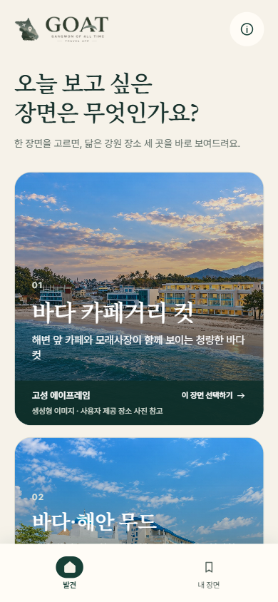
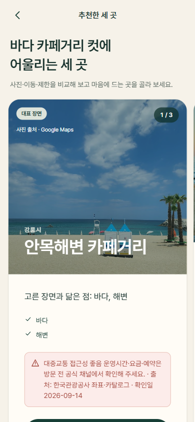
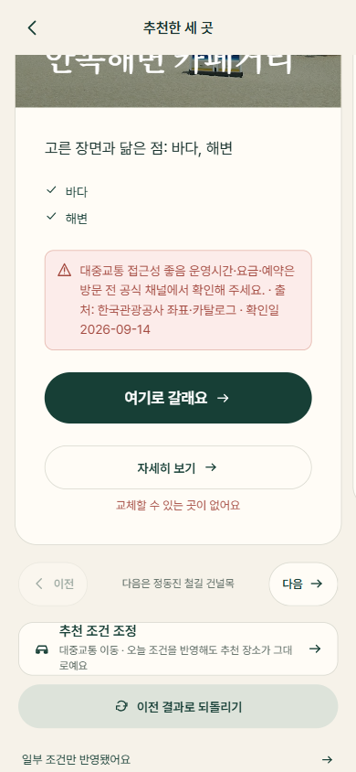
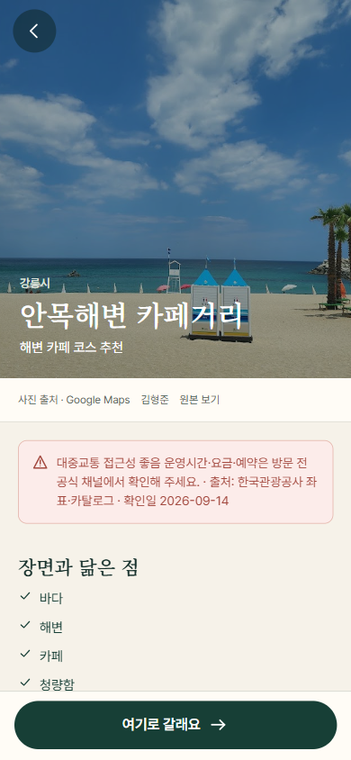
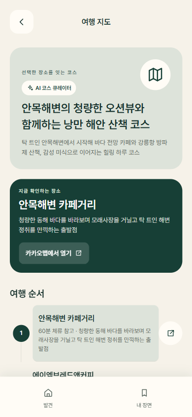
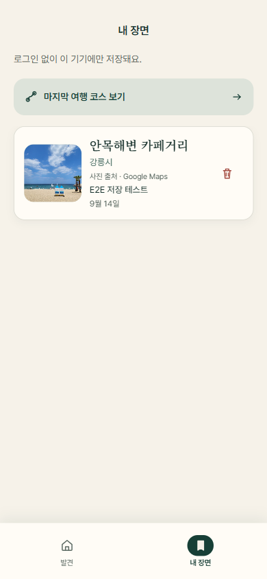
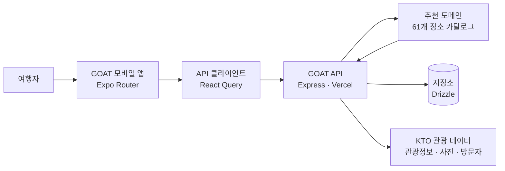

<div align="center">
  

  <h1>GOAT — 강원 감성 여행</h1>
  <p><strong>오늘 보고 싶은 장면에서, 나만의 강원 여행을 시작합니다.</strong></p>
  <p>장면을 고르면 · 조건을 읽고 · 지금 떠날 곳 3곳을 제안하는 감성 기반 여행 발견 앱</p>

  <p>
    
    
    
    
  </p>

  <p>
    <a href="#추천-여정">추천 여정</a> ·
    <a href="#핵심-기능">핵심 기능</a> ·
    <a href="#빠른-시작">개발 시작</a> ·
    <a href="#vercel-배포">배포</a>
  </p>
</div>

<br />

<p align="center">
  
</p>

> **여행지는 검색하는 것이 아니라, 지금의 마음에서 발견되어야 합니다.**
>
> GOAT는 ‘바다 카페거리’, ‘산골 목장’, ‘고즈넉한 골목’처럼 사용자가 끌리는 장면을 출발점으로 삼습니다. 취향과 이동 수단, 실시간 여행 조건을 함께 읽어 강원도 장소 3곳을 제안하고, 마음에 드는 장면은 나만의 여행으로 저장합니다.

## 추천 여정

<table>
  <tr>
    <td width="25%" align="center"><br /><strong>01 · 장면 선택</strong><br />지금 원하는 분위기를 고릅니다.</td>
    <td width="25%" align="center"><br /><strong>02 · 3곳 추천</strong><br />장면에 어울리는 장소를 비교합니다.</td>
    <td width="25%" align="center"><br /><strong>03 · 조건 반영</strong><br />날씨·혼잡도 등 변수를 확인합니다.</td>
    <td width="25%" align="center"><br /><strong>04 · 장소 결정</strong><br />사진과 핵심 정보를 보고 선택합니다.</td>
  </tr>
  <tr>
    <td width="25%" align="center"><br /><strong>05 · 코스 지도</strong><br />동선을 지도에서 이어 봅니다.</td>
    <td width="25%" align="center"><br /><strong>06 · 내 장면</strong><br />마음에 든 여행을 저장합니다.</td>
    <td width="25%" align="center"><br /><strong>07 · 다시 떠나기</strong><br />저장한 선택을 언제든 불러옵니다.</td>
    <td width="25%" align="center"><br /><strong>08 · 다음 장면</strong><br />새로운 영감을 계속 탐색합니다.</td>
  </tr>
</table>

## 핵심 기능

- 장면·레퍼런스·여행 성향을 고르는 단계형 추천 흐름
- 61개 장소 카탈로그를 바탕으로 한 3개 카드 추천과 슬롯별 교체
- 날씨·관광지 혼잡도 등 조건 정보를 반영한 추천 상태 표시
- 장소 상세, 지도 연결, 저장한 장면과 코스 다시 보기
- 게스트 사용을 기본으로 하며 선택적으로 Google/Kakao 로그인을 지원
- 한국관광공사(KTO) 관광 정보·사진·방문자 데이터 연동

<table>
  <tr>
    <td width="33%"><strong>🎞️ 장면 중심 발견</strong><br />키워드 검색보다 먼저, 여행자가 원하는 분위기와 이미지를 고릅니다.</td>
    <td width="33%"><strong>🧭 설명 가능한 추천</strong><br />추천 이유·적용 조건·교체 선택지를 카드 안에서 확인합니다.</td>
    <td width="33%"><strong>📍 저장되는 여정</strong><br />선택한 장소와 메모를 내 장면으로 남기고 다시 불러옵니다.</td>
  </tr>
</table>

## 제품 원칙

| 원칙                  | GOAT의 구현 방식                                                         |
| --------------------- | ------------------------------------------------------------------------ |
| **취향이 출발점**     | 장소명이나 순위가 아니라 장면·무드·이동 맥락에서 여정을 시작합니다.      |
| **데이터는 근거**     | KTO 관광 정보·사진·방문 데이터의 출처와 권리 상태를 보존합니다.          |
| **추천은 통제 가능**  | 3개 카드, 조건 반영 상태, 슬롯별 교체로 사용자가 결과를 조정합니다.      |
| **개인정보는 최소화** | 게스트 흐름을 기본으로 하며 인증 토큰과 공급자 원문은 저장하지 않습니다. |

---

## 개발 및 운영

### 구성

| 경로                    | 역할                                        |
| ----------------------- | ------------------------------------------- |
| `artifacts/goat-mobile` | Expo Router 기반 Android/iOS/Web 클라이언트 |
| `artifacts/api-server`  | Express API와 Vercel Serverless 진입점      |
| `lib/travel-domain`     | 장소 카탈로그와 추천 규칙                   |
| `lib/api-spec`          | OpenAPI 명세                                |
| `lib/api-zod`           | Zod 기반 API 타입·검증 코드                 |
| `lib/api-client-react`  | React Query용 API 클라이언트                |
| `lib/db`                | Drizzle DB 스키마·연결 설정                 |
| `scripts`               | 카탈로그·데이터 검증 도구                   |

### 아키텍처 한눈에 보기



## 요구 사항

- Node.js 24.x
- Corepack
- pnpm 10.28.0

```powershell
corepack enable
corepack prepare pnpm@10.28.0 --activate
pnpm install --frozen-lockfile
```

`package-lock.json`과 `yarn.lock`은 이 프로젝트에서 사용하지 않습니다. 설치와 실행은 항상 pnpm으로 진행하세요.

## 빠른 시작

### 1. 환경 변수 설정

루트 예시 파일을 복사해 로컬 값으로 채웁니다. 실제 키와 비밀번호는 Git에 커밋하지 않습니다.

```powershell
Copy-Item .env.example .env.local
```

API만 별도 실행할 때는 `artifacts/api-server/.env.example`을 참고해 API 프로세스가 읽는 환경 변수를 설정합니다. 모바일 앱은 `artifacts/goat-mobile/.env.example`의 `EXPO_PUBLIC_API_BASE_URL`을 사용합니다.

### 2. API 실행

```powershell
$env:PORT = "3001"
$env:NODE_ENV = "development"
pnpm --filter @workspace/api-server build
pnpm --filter @workspace/api-server start
```

로컬 API 주소는 보통 `http://localhost:3001`입니다. 앱의 `EXPO_PUBLIC_API_BASE_URL`도 같은 주소로 맞추세요.

### 3. 앱 실행

새 PowerShell 창에서 실행합니다.

```powershell
pnpm --filter @workspace/goat-mobile dev
```

Expo CLI가 표시하는 QR 코드 또는 단축키로 Android/iOS/Web 대상을 엽니다.

## 자주 쓰는 명령

| 목적                 | 명령                                                              |
| -------------------- | ----------------------------------------------------------------- |
| 전체 타입 검사       | `pnpm run typecheck`                                              |
| 전체 빌드            | `pnpm run build`                                                  |
| API 타입 검사        | `pnpm --filter @workspace/api-server typecheck`                   |
| API 빌드             | `pnpm --filter @workspace/api-server build`                       |
| API 계약·회귀 검사   | `pnpm --filter @workspace/api-server verify`                      |
| 모바일 타입 검사     | `pnpm --filter @workspace/goat-mobile typecheck`                  |
| Android export 검증  | `pnpm --filter @workspace/goat-mobile build`                      |
| 추천 흐름 점검       | `pnpm --filter @workspace/goat-mobile verify:recommendation-flow` |
| 원스토어 릴리스 점검 | `pnpm --filter @workspace/goat-mobile verify:onestore-release`    |

## 환경 변수

아래는 값의 성격을 기준으로 정리한 목록입니다. 전체 키 목록과 빈 템플릿은 [`.env.example`](.env.example), API 전용 키는 [`artifacts/api-server/.env.example`](artifacts/api-server/.env.example)를 기준으로 합니다.

| 분류         | 변수                                                                                                                                                                                 | 설명                                   |
| ------------ | ------------------------------------------------------------------------------------------------------------------------------------------------------------------------------------ | -------------------------------------- |
| 서버 기본    | `PORT`, `NODE_ENV`, `LOG_LEVEL`, `TRUST_PROXY`, `CORS_ORIGINS`                                                                                                                       | HTTP 서버 실행·로깅·프록시·허용 출처   |
| API 주소     | `GOAT_PUBLIC_API_BASE_URL`, `EXPO_PUBLIC_API_BASE_URL`                                                                                                                               | 공개 API 주소와 모바일 앱 API 주소     |
| 데이터베이스 | `DATABASE_URL`                                                                                                                                                                       | Drizzle이 사용하는 DB 연결 문자열      |
| 관광 데이터  | `KTO_SERVICE_KEY`, `KMA_SERVICE_KEY`, `KTO_PHOTO_RIGHTS_CONFIRMED`                                                                                                                   | KTO·기상 데이터 접근 및 사진 권리 상태 |
| 지도·장소    | `GOOGLE_PLACES_API_KEY`, `ENABLE_GOOGLE_PLACES_CONTENT`, `KAKAO_MOBILITY_REST_API_KEY`, `KAKAO_JAVASCRIPT_KEY`                                                                       | 장소·지도 기능                         |
| 인증         | `AUTH_BASE_URL`, `AUTH_SUCCESS_REDIRECT_URL`, `AUTH_FAILURE_REDIRECT_URL`, `GOOGLE_OAUTH_CLIENT_ID`, `GOOGLE_OAUTH_CLIENT_SECRET`, `KAKAO_REST_API_KEY`, `KAKAO_OAUTH_CLIENT_SECRET` | OAuth 흐름                             |
| 추천 운영    | `RECOMMEND_RATE_LIMIT_WINDOW_SECONDS`, `RECOMMEND_RATE_LIMIT_MAX`, `GEOCODE_RATE_LIMIT_MAX`, `ALLOW_RECOMMENDATION_DEBUG`                                                            | API 제한과 디버그 제어                 |
| AI(선택)     | `OPENROUTER_API_KEY`, `OPENROUTER_BASE_URL`, `OPENROUTER_DEFAULT_MODEL`, `OPENROUTER_ALLOWED_MODELS`                                                                                 | OpenRouter 사용 시에만 설정            |

`EXPO_PUBLIC_` 접두어 변수는 앱 번들에 포함될 수 있으므로 비밀값을 넣으면 안 됩니다. OAuth secret, API key, DB URL은 Vercel/EAS의 환경 변수로만 등록하세요.

## Vercel 배포

API와 모바일 웹은 별도 Vercel 프로젝트로 배포하는 것을 권장합니다. 현재 저장소의 API 배포 설정은 `artifacts/api-server/vercel.json`에 있습니다.

### API 프로젝트

Vercel 프로젝트에서 다음 값을 설정합니다.

| 설정              | 값                                                      |
| ----------------- | ------------------------------------------------------- |
| Root Directory    | `artifacts/api-server`                                  |
| Install Command   | `cd ../.. && pnpm install --frozen-lockfile`            |
| Build Command     | `cd ../.. && pnpm --filter @workspace/api-server build` |
| Node.js           | 24.x                                                    |
| Production Branch | `develop`                                               |

`api/index.mjs`는 빌드 산출물 `dist/index.mjs`를 불러옵니다. 따라서 빌드 명령을 비워 두거나 `dist`를 Git에 넣으면 안 됩니다. Vercel은 이 정적 import를 따라 빌드 후 산출물을 서버 함수에 포함합니다.

배포 전 로컬에서 같은 흐름을 점검하려면 다음을 실행합니다.

```powershell
cd artifacts/api-server
npx vercel build --yes
```

Vercel 대시보드에는 API가 사용하는 모든 서버 비밀값을 Preview와 Production 환경에 각각 등록하고, `CORS_ORIGINS`에는 배포된 웹 앱의 정확한 origin을 추가하세요.

### 모바일 웹 프로젝트

모바일 웹을 Vercel에 올릴 경우에는 별도 프로젝트의 Root Directory를 `artifacts/goat-mobile`로 지정하고 Expo web export 산출물을 배포해야 합니다. API 프로젝트의 rewrite 설정을 모바일 웹 프로젝트에 재사용하면 모든 화면 요청이 API 함수로 전달되므로 안 됩니다.

Android/iOS 배포는 Vercel이 아니라 EAS를 사용합니다. 프로필은 [`artifacts/goat-mobile/eas.json`](artifacts/goat-mobile/eas.json)에 정의되어 있습니다.

```powershell
cd artifacts/goat-mobile
pnpm exec eas build --platform android --profile preview
```

## 검증 기준

변경을 올리기 전 아래 순서로 확인합니다.

```powershell
pnpm run typecheck
pnpm run build
pnpm --filter @workspace/api-server verify
pnpm --filter @workspace/goat-mobile verify:recommendation-flow
```

외부 데이터·OAuth·배포 환경이 필요한 검증은 키가 있는 환경에서만 실행합니다. 키가 없을 때도 타입 검사와 빌드는 통과해야 합니다.

## API와 데이터 계약

공개 API 계약은 [`lib/api-spec/openapi.yaml`](lib/api-spec/openapi.yaml)에, 앱에서 소비하는 생성 타입은 `lib/api-zod`, `lib/api-client-react`에 있습니다. 계약을 바꿀 때는 OpenAPI 명세와 생성 타입을 함께 갱신하고, 화면에서 임시 타입 캐스팅으로 우회하지 않습니다.

추천 응답은 정책·카탈로그 버전, 선택 ID, 적용/미적용 조건, 정확히 3개의 카드, 교체 후보와 revision을 포함합니다. 저장 데이터에는 인증 토큰·공급자 원문·사진 원본을 저장하지 않습니다.

## 운영 원칙

- 장소 ID와 61개 장소 카탈로그는 호환성을 위해 유지합니다.
- 사진·관광 데이터의 출처 및 권리 상태를 UI와 데이터 흐름에서 보존합니다.
- 새 의존성, 프레임워크, 대규모 DB 이전은 추가하지 않습니다.
- 배포 실패 시 Vercel 로그의 첫 오류와 이 README의 API 프로젝트 설정을 먼저 대조합니다.

## 문서

- [`AGENTS.md`](AGENTS.md): 작업 범위, 소유권, 통합 순서
- [`docs/discovery-condition-flow.md`](docs/discovery-condition-flow.md): 발견·조건 반영 흐름
- [`lib/api-spec/openapi.yaml`](lib/api-spec/openapi.yaml): API 계약
- [`artifacts/goat-mobile/eas.json`](artifacts/goat-mobile/eas.json): Android/iOS EAS 빌드 프로필

## 보안

`.env.local`, `.vercel`, 빌드 산출물과 비밀 키는 커밋하지 않습니다. 이미 노출된 키가 의심되면 즉시 공급자 대시보드에서 폐기·재발급하고 Vercel/EAS 환경 변수도 함께 교체하세요.
