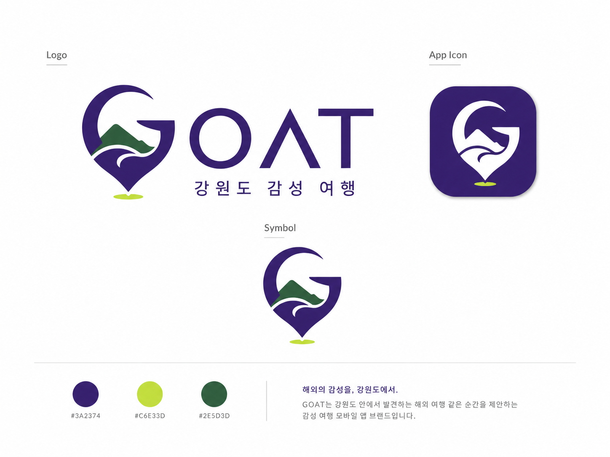

<p align="center">
  
</p>

<h1 align="center">GOAT</h1>
<p align="center"><b>Gangwon Of All Time</b></p>
<p align="center">오늘 기분에 맞는 강원도 여행지를 추천해주는 감성 기반 모바일 앱</p>

<p align="center">
  
  
  
  
</p>

---

## 소개

**"오늘 어디 가지?"** 라는 질문에 감성으로 답합니다.

무드를 고르면 강원도 여행지 3곳을 카드로 추천해줍니다.
동행, 이동수단, 방문 목적, 현재 위치까지 반영한 개인화 추천입니다.

## 주요 기능

- **감성 선택** — 잔잔한 / 웅장한 / 로맨틱 / 힐링 / 액티비티 / 레트로 중 선택
- **사진으로 시작** — 내 사진을 올리면 감성 자동 분류
- **3카드 추천** — 장면 최적 / 내 상황 맞춤 / 안전한 대안
- **KTO 공공데이터** — 공식 사진, 관광 정보, 혼잡도 예측 연동
- **카카오맵 길찾기** — 한 번에 길찾기 실행
- **북마크** — 마음에 드는 장소 저장

## 기술 스택

| 영역 | 기술 |
|------|------|
| 모바일 | React Native, Expo, Expo Router |
| 언어 | TypeScript 5.9 |
| 백엔드 | Node.js, Express 5 |
| DB | Supabase (PostgreSQL) |
| ORM | Drizzle ORM |
| 외부 API | 한국관광공사(KTO), 카카오맵 |
| 패키지 관리 | pnpm workspaces |
| CI | GitHub Actions |

## 프로젝트 구조

```
GOAT/
├── artifacts/
│   ├── api-server/       # Express 백엔드
│   └── goat-mobile/      # Expo 모바일 앱
├── lib/
│   ├── db/               # Drizzle 스키마 (Supabase 연동)
│   ├── api-spec/         # OpenAPI 스펙
│   └── api-client-react/ # React Query 훅
└── 문서/산출물/            # 프로젝트 산출물
```

## 실행 방법

```bash
# 의존성 설치
pnpm install

# 모바일 앱 실행
pnpm --filter @workspace/goat-mobile run start

# API 서버 실행
pnpm --filter @workspace/api-server run dev
```

## 브랜치 전략

```
main          ← 배포
develop       ← 통합
dev/<name>    ← 개인 작업
```

## 산출물

- [기획서](문서/산출물/01_프로젝트_기획서.md)
- [기능명세서](문서/산출물/02_기능명세서.md)
- [ERD](문서/산출물/03_ERD.md)
- [API 명세서](문서/산출물/04_API명세서.md)
- [시스템 아키텍처](문서/산출물/05_시스템_아키텍처.md)
